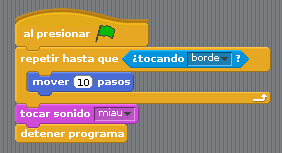

# Programas y programación

Un programa no es más que una serie de pasos ejecutado siguiendo un orden correcto.

Por ejemplo, un hipotético programa podría hacer lo siguiente:

Primero muestra una imagen en pantalla
Después, mientras no llegue al borde de la pantalla, mueve esa imagen a la derecha
Al llegar al borde, emite un sonido

En un (inexistente y muy simplificado) lenguaje de programación al uso, esto se haría de un modo parecido a lo siguiente:

```
$imagen= load_image($archivo_de_imagen);
$sonido= load_sound($archivo_de_sonido);

screen($ancho_de_pantalla, $alto_de_pantalla);

show($imagen,$x,$y);

while ($x < $ancho_de_pantalla){
	$x++
	show($imagen,$x,$y);
}

if ($x == $ancho_de_pantalla){
	play($sonido);
}
```

Este ejemplo es como sería un programa muy simple y, a pesar de que está escrito en un lenguaje inventado, cualquier programador con un poco de práctica puede entender de qué va.

Pero para ello hay que tener al menos un poco de práctica en programación. Además, ejemplos más complejos irán aumentando su dificultad.

Scratch, sin embargo, sigue una filosofía distinta. Como veremos más adelante, Scratch pretende ser una herramienta visual, intuitiva y fácil, que evite las complejidades técnicas y deje todo el espacio para la imaginación y la expresividad.

El mismo programa anterior, pero hecho en Scratch, tendría el siguiente aspecto:



Como se puede ver es **gráfico**, es **simple** y es **intuitivo**. Esta es la herramienta que vamos a aprender a usar en este curso.