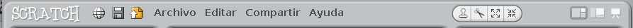
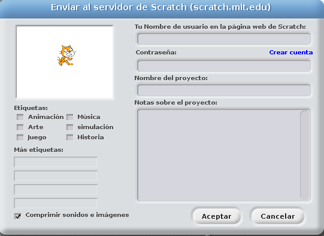
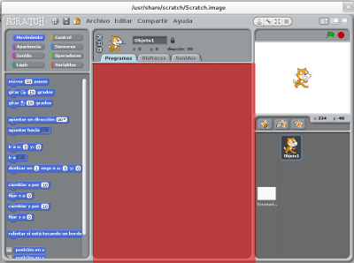
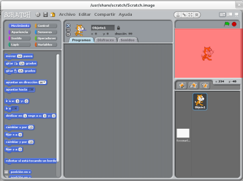
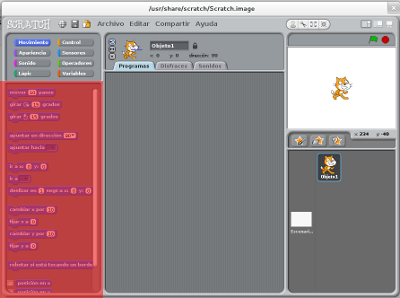
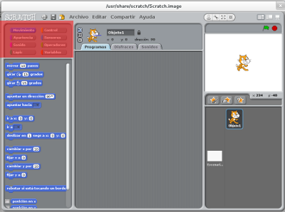
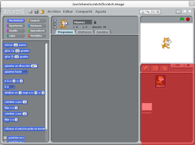

# Primeros pasos
Scratch se inicia (o "ejecuta", o "arranca") como cualquier otro programa de nuestro ordenador.

En Windows lo normal es buscarlo en el menú inicio, aunque quizás también se haya instalado un icono en el escritorio. En otros sistemas operativos habrá que usar la barra de aplicaciones o actividades o, en general, el procedimiento que se use normalmente para cualquier otro programa.

En cualquier caso, el icono de Scratch es siempre el mismo: La caricatura de la cabeza de un gatito parecido a este:

Ese gatito también se llama "Scratch", es al mismo tiempo la mascota y el principal elemento de trabajo de este programa, y vamos a acostumbrarnos a verlo mucho en adelante.

Al hacer clic en nuestro gatito se inicia el programa, que tiene un aspecto parecido a este:

La apariencia exacta de algunos detalles puede cambiar entre versiones o sistemas operativos, pero es básicamente igual en todos ellos y su uso idéntico.

Como puede verse al primer vistazo, se han elegido formas redondeadas y suaves y se ha optado por la simplicidad de diseño, todo ello con la idea de conformar un entorno relajado y en el que al niño le resulte cómodo trabajar. El tamaño y las proporciones de la ventana pueden modificarse para adaptarse al tamaño de la pantalla o nuestras preferencias.

Veamos ahora, en las siguientes secciones, cada elemento de la ventana de Scratch.

## Barra de botones y menús

En la parte superior del programa hay una barra de botones y menús que nos permite una serie de opciones (en el caso de los botones, se muestra un texto descriptivo al pasar el puntero por encima).

Al pulsar el primer botón, con forma de "bola de mundo", se muestra un largo menú que sirve para cambiar el idioma del programa. Como se puede ver, está traducido a una gran cantidad de idiomas.

El siguiente botón es el clásico icono de un disquette que sirve para guardar el programa que estemos haciendo.

El siguiente es más interesante, y es una peculiaridad de Scratch: Sirve para subir el trabajo que hemos hecho a la página oficial del MIT y compartirlo públicamente.

La filosofía de educativa que hay detrás de Scratch tiene en el hecho de compartir el conocimiento como 
uno de los ejes fundamentales del aprendizaje, y con esta herramienta se facilita enormemente ese acto de compartir.

Al pulsar ese botón, se abre una ventana que permite "etiquetar" el programa (poner pequeños textos o palabras que lo describan), ponerle un nombre, escribir una pequeña descripción y subirlo a nuestra cuenta en las páginas del MIT.

Como la primera vez que se use Scratch es muy probable que no tengamos esa cuenta, un enlace permite acceder a la página oficial de Scratch, donde un pequeño formulario nos permite crear una.

Esa cuenta es gratuita pero, dado que Scratch está pensado para ser usado tanto por adultos como por niños de todas las edades, existen unas normas básicas de comportamiento que rigen qué clase de cosas son adecuadas para ser puestas en la web. Esas normas pueden leerse siguiendo un enlace que hay en el propio formulario de inscripción. 

A continuación tenemos los clásicos menús de "Archivo" (para crear, abrir o guardar proyectos), "Edición" (deshacer acciones o cambiar algunos parámetros de trabajo) "Compartir" (que hace lo mismo que el botón homónimo que ya hemos visto) y "Ayuda" (que sirve como enlace con las páginas de ayuda que el MIT ha preparado para Scratch).

Después hay una serie de pequeños botones que se usarán para manipular copiar y modificar objetos, y cuyo uso veremos más adelante, seguidos de otro grupo de botones muy útiles que cambian la forma de presentar los espacios de trabajo para usarlos más cómodamente.

## El área de trabajo

La parte principal de nuestro entorno está ocupada por el área de trabajo. 

Normalmente ahí estaremos haciendo nuestro programa, por lo que también se llama "área de programas". Sin embargo, podemos ver que hay tres pestañas justo sobre este área, que permiten cambiar entre tres espacios de trabajo distintos para distintas tareas: "programas" (que es la que se muestra por defecto y la que más usaremos), "disfraces" y "sonidos".

Cuando estemos creando un programa, o haciendo casi cualquier trabajo dentro de Scratch, será aquí donde lo hagamos.

Justo encima de este área tenemos el selector de objetos. Al iniciar Scratch, ya comienza con un objeto creado (Scratch, el gatito que se muestra) pero podemos crear muchos más.

Cada objeto puede tener uno o más programas que indiquen cosas como su movimiento, lo que hace, etc; con este selector elegimos con cuál de los objetos estamos trabajando.

## El escenario

El escenario es donde todo ocurre.

Todo lo que hagamos, todo aquello que ordenemos a nuestro programa, lo hará aquí.

Si nuestro programa es una animación, se representará en esta ventana. Si es un juego, será aquí donde juguemos.

En su parte superior derecha pueden verse un par de iconos. El primero, una bandera verde, sirve para iniciar nuestro programa, juego o animación, y el círculo rojo sirve para detenerlo.

## Bloques
Otro par de áreas muy importantes son la paleta de bloques y el selector de grupos de bloques.

La paleta de bloques contiene las piezas (bloques) que usaremos para crear un programa. Cada una de estas piezas hace una tarea básica, y varias de ellas juntas conforman un programa. Puede verse que estos bloques imitan el aspecto de piezas de puzzle.

La verdad es que, fácilmente, puede suponerse de un modo intuitivo cómo vamos a usar los bloques.

Como veremos más adelante, para hacerlo sólo debemos tomar la pieza que necesitamos en un momento dado, arrastrarla con el ratón a nuestro área de trabajo, y unirla a las que ya tenemos allí como si de un puzzle se tratara. También iremos viendo cómo cada tipo de bloque (pieza) tiene una forma distinta, que le permite encajar sólo con las piezas con las que sea lógicamente compatibles.

Dado que hay muchas más piezas de las que se pueden mostrar al mismo tiempo de una forma cómoda, se han agrupado en clases (grupos) según el tipo de uso que tengan, y cada uno de estos grupos puede verse sobre la paleta de bloques, en el área de selección de grupos de bloques.

Haciendo click en cada uno de esos grupos, los bloques mostrados en la paleta de bloques cambian a los de ese grupo, y así podemos escoger el que nos interese en cada momento.

## Objetos personales

Abajo a la derecha está el área de objetos personales. Aquí podemos crear, seleccionar y manipular nuestros propios personajes y elementos para usarlo en nuestros juego y animaciones. También podemos seleccionar objetos que ya hayamos creado (y guardado) antes, o incluso elegirlo de una selección que el propio juego trae consigo.

A efectos prácticos, para Scratch un "objeto" no es más que un dibujo al que luego le podremos añadir programas para que actúe de cierta forma. De este modo el creador de objetos, al que se accede pulsando el primero de lo iconos de este área (la estrella con un pincel), no es mas que un programa de dibujo muy simple, pero muy completo.

El editor de objetos es en sí mismo un juego, y resulta una herramienta muy intuitiva y divertida. permite dibujar a "mano alzada" o usar varias herramientas básicas comunes a este tipo de programas.

A pesar de que su uso es, como decimos, muy intuitivo, es recomendable dedicar algún tiempo a explorar esta herramienta y dibujar con ella. Una vez que hayamos dibujado nuestro objeto y estemos satisfechos con el resultado, no tenemos más que darle al botón "Aceptar" y ya habremos creado nuestro primer objeto.

Si no estamos muy satisfechos con nuestras habilidades artísticas, podemos usar el siguiente botón "Escoger un nuevo objeto desde archivo" (la estrella con una carpeta) para elegir uno de los objetos "prefabricados" que tiene Scratch. Si nos sentimos aventureros, el siguiente botón (estrella con signo de interrogación) se llama "Objeto sorpresa", y sirve para que el mismo programa elija por nosotros un objeto completamente al azar.

Cuando tenemos varios objetos, se muestran todos en esta pantalla. Aquí podemos hacer click en cada uno de ellos para seleccionarlo y trabajar sobre él. Cuando se selecciona aquí, los programas etc que veamos en el área de trabajo serán los correspondientes a este objeto.

