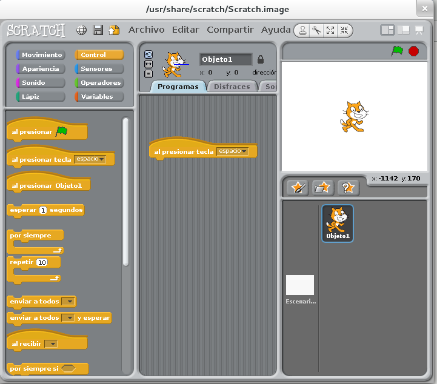
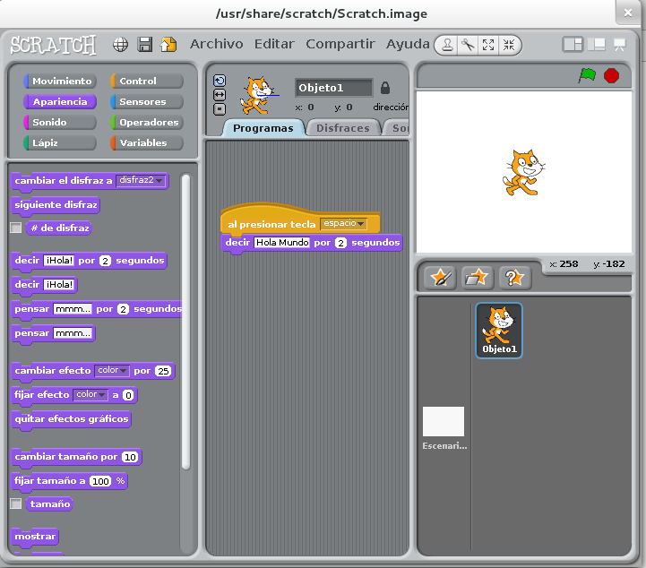
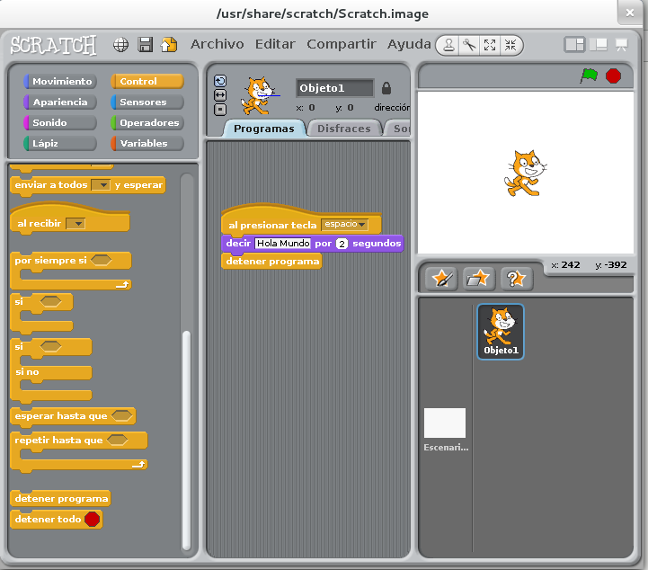
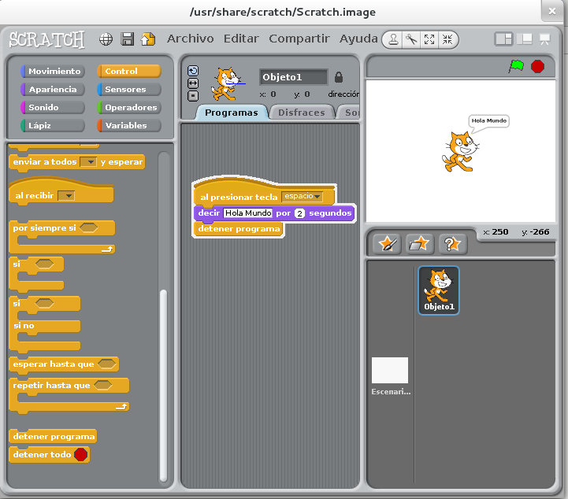

# Primer programa
Vamos a crear ahora un pequeño programa para poder ver lo simple, visual divertido que es hacerlo con Scratch.

Existe una especie de tradición entre los programadores consistente en que el primer programa que se hace con cualquier lenguaje es siempre un "Hola Mundo".

Un "Hola Mundo" no es más que un programa que muestra en pantalla ese mismo texto.

Como el nuestro es un lenguaje de programación muy visual, lo que haremos será hacer que nuestro gatito (que ya dijimos que se llamaba Scratch) muestre un "bocadillo" (un globo de texto como los de los comics y tebeos) diciendo el consabido "Hola Mundo".

Lo veremos paso a paso.

En el selector de bloques (arriba a la izquierda) seleccionamos "Control". Al hacerlo, en la paleta de bloques se nos mostrará una serie de estos que sirven para "controlar" el programa. Es decir, para indicarle cuándo y en qué condiciones debe ejecutar una serie de órdenes.

Nosotros elegiremos "Al presionar tecla ---". Sólo tenemos que hacer click con el ratón sobre esa pieza y arrastrarla a nuestro área de trabajo.

Por defecto viene indicada la tecla "espacio". Se puede elegir otra haciendo click encima pero, por ahora, vamos a dejar esta. De este modo, indicamos a Scratch que las instrucciones que coloquemos a continuación deben ejecutarse cuando se pulse esta tecla.

Después elegiremos el grupo de bloques "Apariencia", que nos mostrará una serie de piezas que sirven para indicar cómo se visualizan distintas cosas en pantalla. De aquí cogeremos el bloque "Decir --- por - Segundos". Arrastraremos esta pieza y la colocaremos justo debajo de la anterior (se puede ver cómo se "pega" a ella, encajando perfectamente.

Aquí podemos cambiar tanto el texto mostrado (dice "Hola" por defecto) como el tiempo durante el que se muestra (dos segundos, por defecto). Vamos a cambiar el texto, haciendo click encima del que hay, y poner "Hola mundo". El tiempo lo dejaremos como está.

Después, volvemos a seleccionar el grupo de bloques "Control", donde elegimos "finalizar programa" y lo agregamos tras la instrucción anterior. Como en el caso anterior, esta pieza encajará como un puzzle con la inmediatamente superior.

Para probar nuestro programa sólo tenemos que pulsar la banderita verde que hay en el escenario (arriba a la izquierda). Una vez hecho esto, probaremos a pulsar la barra espaciadora (que es la que hemos indicado en nuestro programa) para ver lo que hace.

Si hemos hecho todo bien, Scratch saludará al mundo.

Enhorabuena!! Hemos hecho nuestro primer programa.

**NOTA**: En realidad, para probar nuestro ejemplo no hace falta pulsar la bandera verde (ni el botón rojo para pararlo) pero sí será necesario en ejemplos más complejos. 

Todo los elementos de un programa se usan del mismo modo: uniendo piezas de puzzle. Este es un buen momento para empezar a darles un vistazo y probar a ver qué hacen (la mayoría de los textos son perfectamente autoexplicativos).