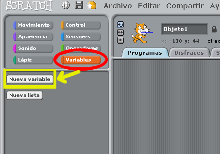
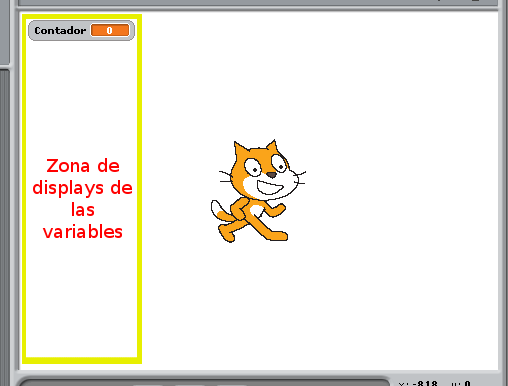

# Variables
Veamos como se usan las variables de Scratch.

## Crear/Eliminar variables

Para crear variables haremos como se ve en la imagen, así nos aparecerá el siguiente diálogo:

Bien, le ponemos un nombre a la variable y le indicamos el ámbito de esta. El ámbito de la variable puede ser local o global como se usa en el coloquio de la programación, el ámbito global es una variable digamos compartida que aquí en Scratch es indicar que la variable es "Para todos los objetos" o bien la podemos declarar como variable local, es decir "Para este objeto" así será una variable que sólo podremos manejar en el objeto en cuestión para el que la declaremos.

Por ejemplo en el siguiente ejemplo hemos creado una variable llamada "Pasos" para contar el número de pasos que da el gato de Scratch (es de ámbito local al objeto). Una vez creada nos aparecerá lo siguiente:

Podemos crear tantas variables como queramos y nos sean necesarias. Cuando tenemos 2 o más variables nos aparecerá el listado de las mismas y para manejarlas tendremos que cambiar en las piezas la variable a usar/modificar que queramos.

Y para eliminar una variable creada lo único que tendremos que hacer es hacer click sobre el botón de "Borrar una variable" y seleccionar la variable a eliminar, muy sencillo.

#### ANOTACIÓN
Cuando se crean variables se recomienda seguir una nomenclatura, sobre todo si tenemos muchas variables, por ejemplo para 3 variables que guardarían el nombre de 3 personas podríamos nombrar esas variables como:
* "nombre_persona_1"
* "nombre_persona_2"
* "nombre_persona_3"

Notad que se separan el nombre de las palabras con un guión bajo, esto es para hacer una lectura más fácil.

- - -

## Modificar variables
Bien las variables existen para básicamente almacenar información, pero otro de sus objetivos es poder almacenar información de forma dinámica a lo largo de la ejecución de un programa, así que veamos que podemos hacer con una variable:

1. Acceder a su información
Podemos acceder a su contenido de varias maneras con las piezas de Scratch, por ejemplo podemos crear una variable que almacene un mensaje para que nuestro gato de Scratch lo diga de forma intermitente.  

2. Modificar su contenido
Una variable la podemos modificar de muchas maneras, por ejemplo preguntando algo y el mensaje recibido guardarlo en una variable, también la podemos modificar para que tenga un valor fijo al inicio del programa, etc.

En el ejemplo anterior podemos ver también como modificamos una variable.

- - -

## Mostrar / Esconder variables
Cuando programamos en Scratch usando variables nos puede ser interesante mostrar en el escenario el contenido de las mismas. Lo que se muestra es una cajita en la esquina superior izquierda como se puede ver en la siguiente imagen:

Para mostrar u ocultar estas cajitas podemos usar estas piezas:

Las cuales no precisan de mucha explicación, sólo que en la cajita que tienen las piezas se tiene que indicar a qué variable afecta, ya que podemos tener varias variables y podemos querer mostrar unas variables y otras no a lo largo de la ejecución del programa.