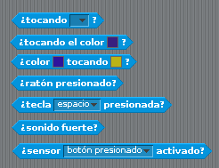
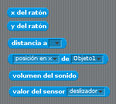
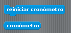

# Sensores
Aunque su uso se verá más detalladamente en capítulos posteriores, es hora de conocer los sensores.

Los sensores se encuentran en el selector de grupos de bloques con el nombre de "Sensores" y son, en cierto modo, una familia de bloques parecidos a los operadores pero que, en lugar de operar sobre otros datos, extraen la información de los programas y objetos.

Sirven para obtener datos como, por ejemplo, dónde está ubicado un objeto, si una tecla determinada está presionada o cuál es el volumen del sonido.

Como en el resto de bloques que tenemos, sus distintas formas indican dónde encajan y, por tanto, cuál es su uso.

Existe un grupo de sensores lógicos, que podemos ver en la imagen de abajo y que retornan, como hemos visto antes, un valor de cierto o falso:

Otro grupo de sensores retorna una cadena (normalmente un número) que se puede recoger para usarlo en nuestros programas:

Dentro de estos últimos hay dos casos ligeramente especiales.

El primero es el cronómetro que, además de tener un bloque para recoger su valor en un momento dado, tiene otro para reiniciarlo y ponerlo a cero.

 
El otro es una herramienta muy útil ya que consta de un elemento que permite abrir un diálogo para que el usuario pueda introducir un dato, acompañado del correspondiente sensor para recoger y manipular este dato.

 

Vamos a verlo con un ejemplo, usando sensores y operadores conjuntamente para obtener un pequeño programa muy simple pero con un poquito de interactividad:

