# Control
Veamos sobre lo que trata el control de objetos de Scratch.

## Introducción
Cuando programamos en Scratch uno de los pilares básicos es el control de los objetos, para así conseguir los objetivos que tengamos en mente, como por ejemplo controlar la repeticiones de una acción, o lo que queremos que se ejecute al incio cuando pulsamos la bandera de inicio del programa.

Es de los apartados más importantes ya que aquí definiremos el momento en que se tienen que ejecutar las acciones, podemos controlar condiciones para que se ejecuten otras acciones o también podemos controlar la parada de los programas.

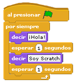

## Piezas
Este bloque de Scratch es el bloque donde tenemos todas las directivas para poder controlar los objetos de nuestro programa.
Así entonces las podemos agrupar en los siguientes apartados:

### Al presionar...
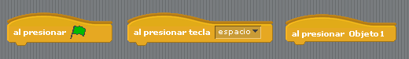

Hay 3 directivas de este tipo como se puede ver en la imagen, el significado de cada una es:

* **Al presionar la bandera**  
Este control nos sirve para que las piezas que pongamos debajo se ejecuten cuando le demos a la bandera verde para iniciar el programa, que se encuentra en la parte superior derecha de la ventana donde se puede ver la ejecución de un programa.

* **Al presionar una tecla**  
Cuando presionemos la tecla que esté indicada en el recuadro que aparece junto a la pieza, se ejecutará todo lo que englobemos con esta pieza.

* **Al presionar el objeto**  
Cuando hagamos click sobre el objeto que indica esta pieza se ejecutará lo que englobemos en esta pieza.

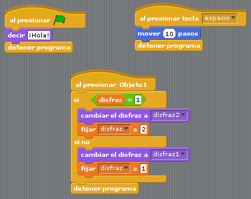

### Condiciones de espera

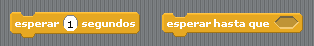

Con estas piezas conseguiremos pausar la ejecución de un bloque de directrices un tiempo especificado (la pieza de la izquierda de la imagen) o bien se pausará la ejecución hasta que no se cumpla una condición.

La segunda pieza nos puede servir por ejemplo para reanudar la ejecución de un objeto cuando una variable que hayamos especificado tome un valor determinado.

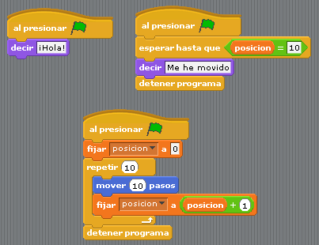

### Repetición de acciones

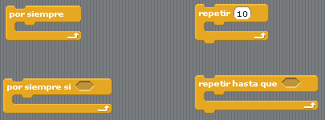

Estas piezas son piezas que se usan muy pero que muy a menudo, sirven para repetir una serie de acciones (lo que se llaman bucles) según se den ciertas condiciones o de forma indefinida. Así veamos que significan estas 4 piezas:

* **Por siempre**  
Lo que incluyamos en esta pieza se repetirá de forma indefinida. Por ejemplo si queremos incrementar una variable que hemos definido por cada segundo.

* **Por siempre si < >**  
Mientras que se cumpla la condición que incluyamos en el hexágono de la pieza se repetirá lo que englobemos aquí.

* **Repetir <>**  
Si queremos que algo se repita un número de veces determinado esta es nuestra pieza.

* **Repetir hasta que < >**  
Esta pieza es parecida a la de "Por siempre si..." ya que repetirá las acciones hasta que no se cumpla la condición que indiquemos en el hexágono.

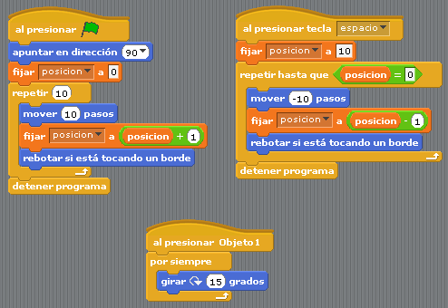

Como nota extra para este apartado, podemos ver que de estas 4 piezas hay dos (Por siempre y Por siempre si<>) a las que no les podemos añadir ninguna otra pieza a continuación de ellas, esto se debe a la lógica de la pieza, ya que si indicamos que se repitan una serie de acciones por siempre, estamos diciendo que sea de forma indefinida a menos que paremos el programa, así que tendremos que tenerlo en cuenta.

### Ejecutar acciones según condiciones

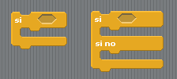

En el desarrolo de un programa es bastante normal que se tengan que ejecutar ciertas acciones si se da una condición o ejecutar otras si no se da.

Para esto tenemos estas piezas para programar condiciones de ejecución:

* **Si < >**  
Nos sirve para ejecutar un trozo de programa si se da la condición indicada en el hexágono que acompaña la pieza.

* **Si < >   Si no...**  
Es igual que la pieza anterior salvo que podemos incluir otras acciones si no se cumple la condición indicada.

Estas dos piezas las podemos ir anidando como sea conveniente, un ejemplo sencillo es mostrar un mensaje dependiendo del valor de una variable:

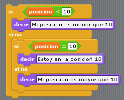

### Enviar y recibir mensajes

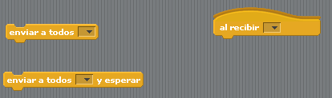

Los mensajes nos sirven para establecer digamos una comunicación entre los objetos, veamos que significan las piezas:

* **Enviar a todos []**  
Enviamos el mensaje que indiquemos en la caja a todos los objetos del escenario.
* **Enviar a todos [] y esperar**  
Nos sirve igual que el anterior solo que cuando se envía el mensaje el objeto se queda en un estado de pausa, cuando se pausa podríamos seguir ejecutando acciones en el objeto usando la siguiente pieza de este tipo.
* **Al recibir []**  
Cuando enviamos un mensaje este lo tenemos que procesar en algún objeto, pues esta pieza nos sirve para eso, para ejecutar acciones cuando se recibe un mensaje.

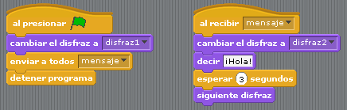

En este ejemplo de un sólo objeto enviamos el mensaje "mensaje" y se procesa en el mismo objeto, pero lo podemos expandir a más objetos con diferentes mensajes a enviar.

### Detención
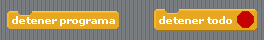

Tenemos dos piezas de detención:

* **Detener programa**  
Con esta pieza tenemos un programa de un objeto ya que a cada objeto le podemos asignar varios programas.

* **Detener todo**  
Esta para la ejecución de todos los programas de todos los objetos.

## Anotaciones
Fijaos que hay 3 tipos de piezas que podemos diferenciar por la estructura de su dibujo, dicho en otras palabras, hay piezas a las que podemos ponerle una pieza a continuación, las piezas que sólo admiten una (o una serie) de piezas por encima de ella y las que aceptan piezas tanto por encima como por debajo.

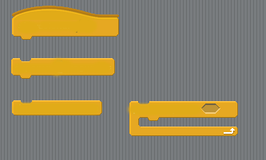

Es decir, las que sólo admiten una o más piezas por debajo son para iniciar un proceso. Luego tenemos las piezas antagónicas que son para indicar donde acaba un proceso. Y el resto de piezas, aunque podemos decir que hay otro tipo más que es una mezcla de una pieza normal con una pieza "terminadora", que es la que podemos ver en la imagen anterior a la derecha, que hace un proceso repetitivo pero después de este proceso ya no podemos continuar el programa, veamos un ejemplo de como podemos usar estas piezas:

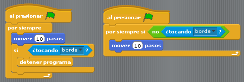

Ambos procesos que se ven, hacen exactamente lo mismo, mover a Scratch hasta que toca un borde del escenario, salvo que el proceso de la derecha en la práctica nunca para, haced un programa copiando estas piezas y ejecutad ambos procesos (primero el izquierdo y luego el derecho) veréis como con el proceso derecho Scratch para de andar pero si lo movemos a otra parte vuelve a andar, y la única manera de parar el proceso es dándole al botón de Stop que tenemos al lado de la bandera verde.

Tened este detalle en cuenta para que no se disloquen los programas que hagáis más adelante.