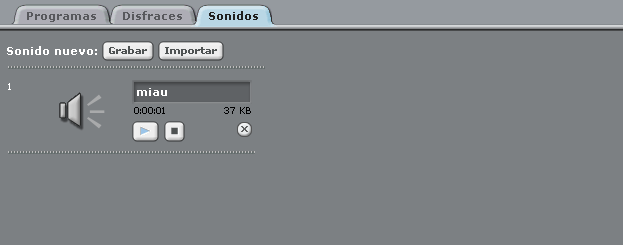
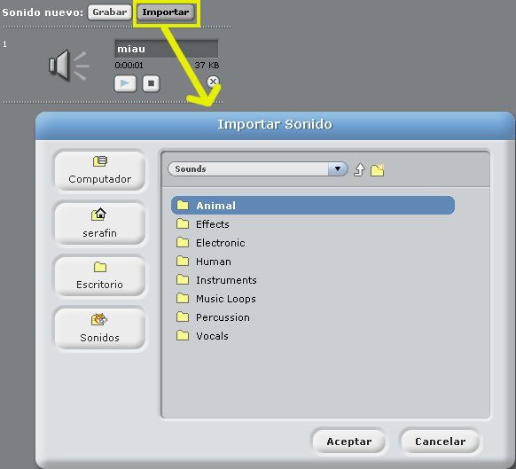
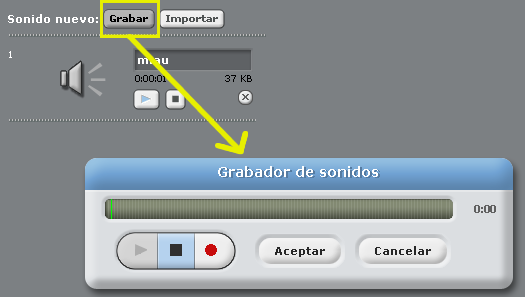
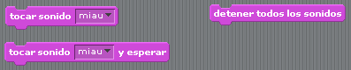
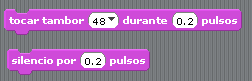
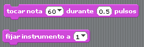
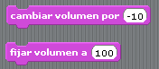
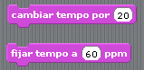

# Multimedia

## Introducción
Como bien se indica en la [Wikipedia](https://es.wikipedia.org/wiki/Multimedia "Multimedia según la Wikipedia"):

*"El término multimedia se utiliza para referirse a cualquier objeto o sistema que utiliza múltiples medios de expresión (físicos o digitales) para presentar o comunicar información"*

Este término engloba textos, sonidos, imágenes, animaciones, vídeos, proyecciones, interatividad y un sinfín de más cosas. Así Scratch tiene un aspecto dedicado al uso de la multimedia.

Podemos indicar que Scratch hasta el momento sólo soporta el manejo de imágenes, sonido, animaciones e interactividad, y decimos estos apartados ya que son los que saltan a simple vista:

* ***Imagen***  
Podemos crear, editar e importar tanto escenarios, como objetos.

* ***Sonido***  
Existe una multitud de sonidos y una gran configuración de los mismos.

* ***Animación***  
Mediante el apartado de Movimiento visto antes, podemos hacer unos programas más animados.

* ***Interactividad***  
Una de las grandes bazas de Scratch es la interactividad, ya que de una forma gráfica y animada también por medio de sonidos conseguimos una interactividad de un alto nivel.

## Importando y grabando sonido
Para los objetos que tenemos les podemos asignar sonidos, estos pueden ser los que vienen con la instalación de Scratch o bien podemos importar sonidos extra de nuestro repertorio de música y sonidos personales.

Así para cuando tenemos seleccionado un objeto en la zona de trabajo del objeto tenemos una pestaña que se llama "Sonidos" y haciendo click en ella nos llevará a este aspecto de Scratch que será algo como esta imagen:

Muy bien pues entonces podemos bien importar nuestros sonidos/música, para ello el formato del fichero a importar debe ser soportado por Scratch para que pueda convertirlo de manera que se pueda reproducir. Algo que tenemos que saber también es que con Scratch no vamos a poder hacer retoque de sonido así que tenlo en cuenta por si se te había ocurrido esto, para hacer estas tareas podremos usar otras aplicaciones tales como Audacity.

Entonces, ¿cómo importo un sonido o una canción? Muy sencillo, haz click en el botón de Importar y con la ventana de diálogo que se te abrirá será cuestión de que navegues por tu sistema operativo hasta dar con el fichero que quieras importar:

Y para grabar un sonido ¿es difícil? No, para nada es mucho más sencillo aún que importar un sonido, grabando un sonido podemos grabarnos por ejemplo a nosotros en varios diálogos para usarlos según ciertas acciones y todo tipo de sonido puedes grabar, eso sí claro está que necesitarás de un micrófono (no importa si es el micrófono integrado de tu portátil como si es un micrófono profesional, mientras que el sistema operativo te lo reconozca perfecto). Así haremos click en el botón de Grabar y se nos abrirá la ventana con la grabadora de sonidos, muy sencilla de utilizar:

## Piezas
Al igual que en resto de apartados tenemos una serie de piezas para programar una de las partes más amenas y que amenizarán nuestros programas en Scratch. Bien, veamos de que disponemos:

### Imagen
La parte multimedia de imagen queda explicada en el siguiente tema del curso, así que para el ejercicio de este tema no será necesario usar este aspecto.

### Sonido
Bien, veamos lo que podemos hacer en cuanto al aspecto de sonido:
* **Tocar y parar los sonidos**  
  
Podemos hacer que suene algún sonido de los que vienen con Scratch que hay una amplia gama para ello y además también podemos hacer que suene hasta alguna canción que tengamos, siempre y cuando Scratch reconozca el formato para que así pueda convertir la canción de tal manera que la pueda reproducir. Para esto usaremos la primera pieza que vemos y seleccionaremos el sonido de los que aparezca en la lista, que serán los sonidos que tiene el objeto en su pestaña de "Sonidos".  Al igual que puede sonar también puede sonar un sonido y estar a la espera o bien si están sonando varios sonidos podríamos llegar a pararlos todos cortando el flujo de sonido.

* **Tocar tambor**  
  
Para la primera pieza tenemos una gran variedad de sonidos de tambores, así que podremos hacer sonar el que queramos por el tiempo definido en la caja de pulsos, es decir la duración de segundos. La siguiente pieza, la de sonido por [] segundos indica eso mismo, conseguir un sonido, una pausa por el tiempo definido en la caja de pulsos.

* **Fijar un instrumento y hacer sonar una nota**  
  
Podemos fijar instrumentos como por ejemplo un Piano, Guitarras, Xilófonos entre otros muchos, así los sonidos que reproduzcamos con la pieza de "Tocar nota" será la nota definida en la caja para el instrumento fijado y se reproducirá por unos pulsos definidos en la caja correspondiente.

* **Cambiar y fijar el volumen**  
  
No hay mucho que explicar aquí, sencillamente son las piezas para cambiar (subir y bajar) el volumen del sonido que se esté reproduciendo o bien podremos fijar el volumen a un nivel.

* **Cambiar y fijar el tempo**  
  
Aquí también pasa igual que antes solo que es para el tempo de los sonidos.

* **Displays**  
  
Y al igual que en otros aspectos de Scratch podemos visualizar mediante unos displays el volumen y el tempo de los sonidos.