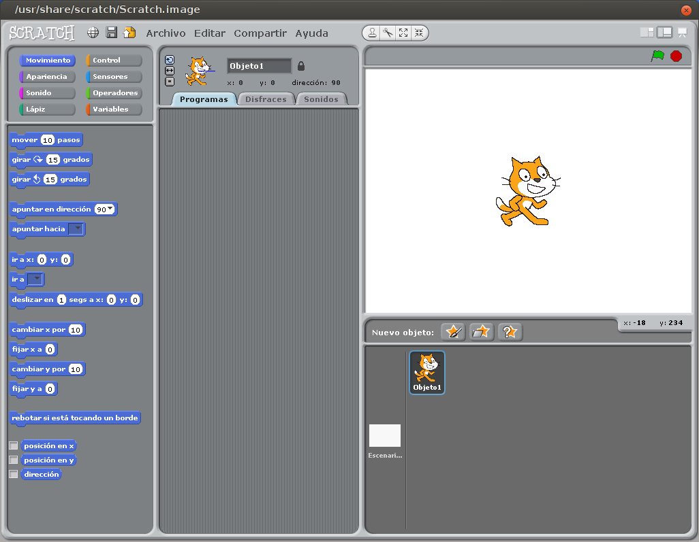
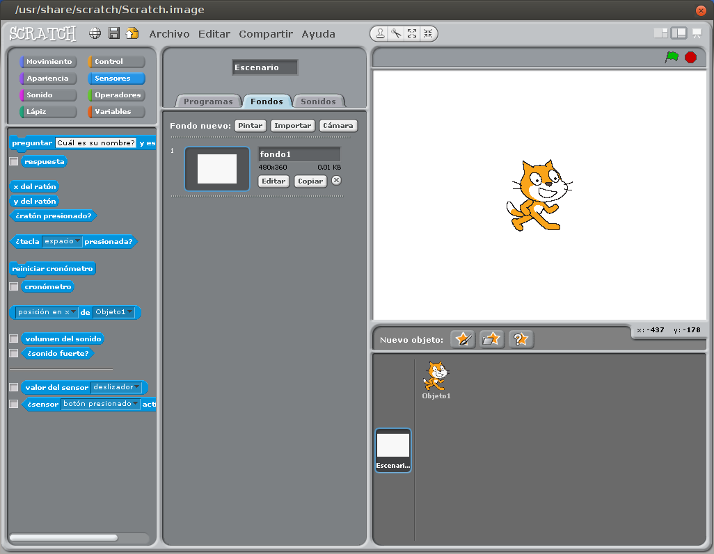
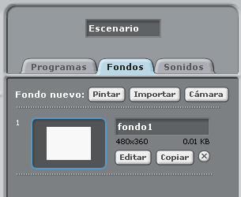
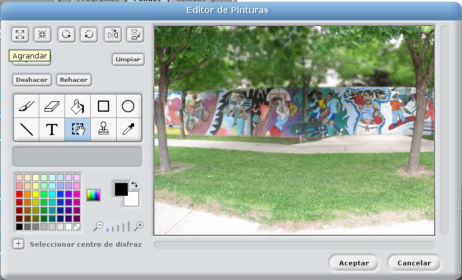
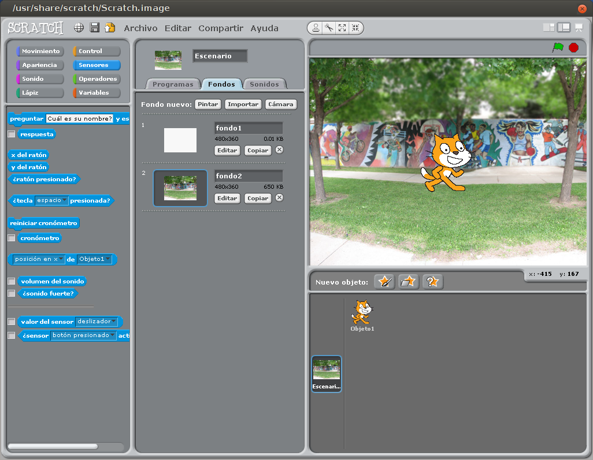

# Creación de Escenario

Partimos del programa en su estado inicial.

En la parte inferior tenemos una imagen que pone Escenario, pulsamos ahí y se nos abre la ventana de esta manera.

Y seleccionamos la pestaña Fondos, en la zona central de nuestro programa, y nos aparecen tres botones: Fondo, Importar y Cámara. Veámoslos.

* Fondo

Seleccionamos el botón editar, y nos aparece:

El cual nos permite, dibujar sobre el lienzo, utilizando las herramientas que nos trae, desde una brocha a insertar texto, podemos cambiar los colores.

Utilizando el botón importar, podemos usar las imágenes predefinidas que nos trae Scratch.

Con el botón limpiar podemos quitar todo lo que hemos dibujado, importado, etc, (tener cuidado que lo deja en blanco y podemos perder todo lo que hallamos dibujado).

En nuestro caso vamos a usar un archivo que ya existe, para ello usamos Importar y se nos abre el cuadro de diálogo.

Nos vamos a Outdoors y seleccionamos.

Una vez seleccionado nos quedará así:

Aceptamos, y ya tenemos nuestro fondo para el videojuego.

* Importar

Si usamos la opción Importar, nos ahorramos los pasos anteriores, o podemos escoger el fondo de otras carpetas de nuestro ordenador.

* Cámara

Si usamos la opción de Cámara, usara la WebCam de nuestro equipo y hará una captura.