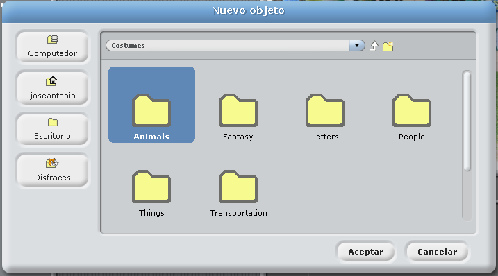
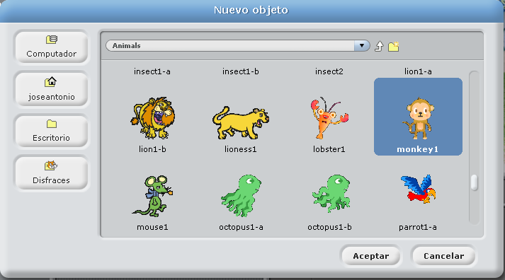
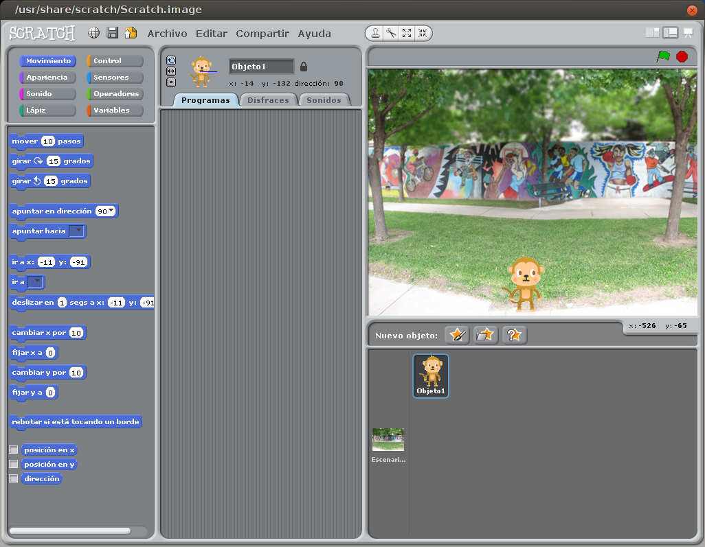
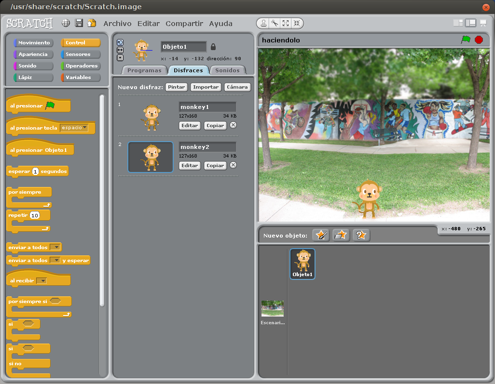
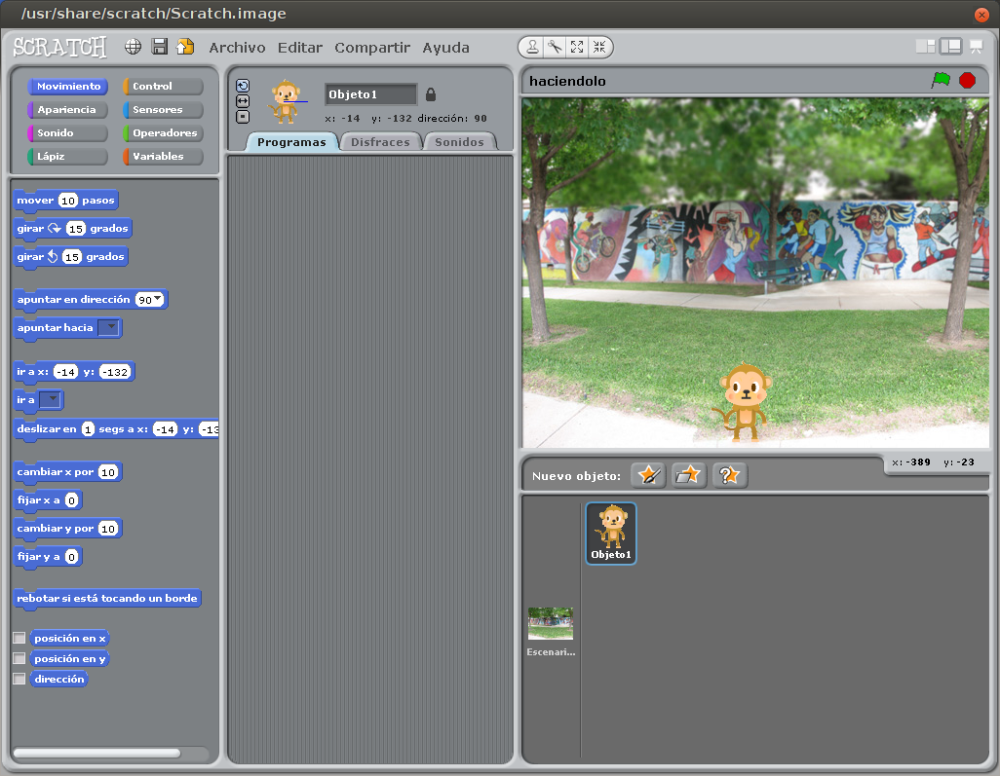
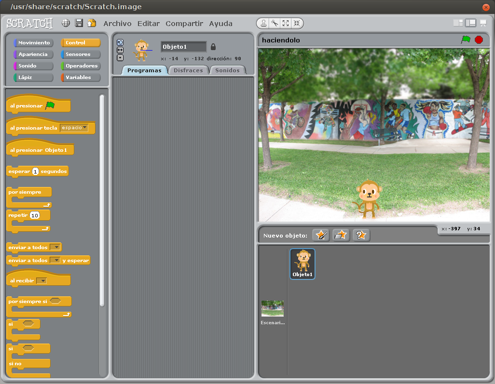
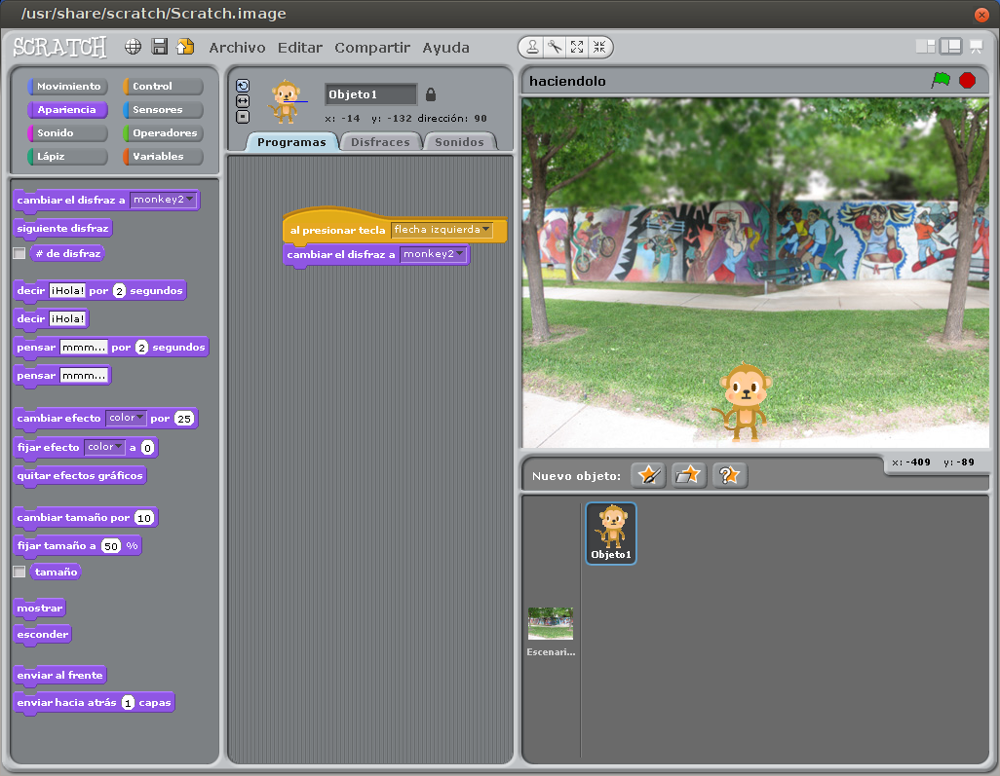
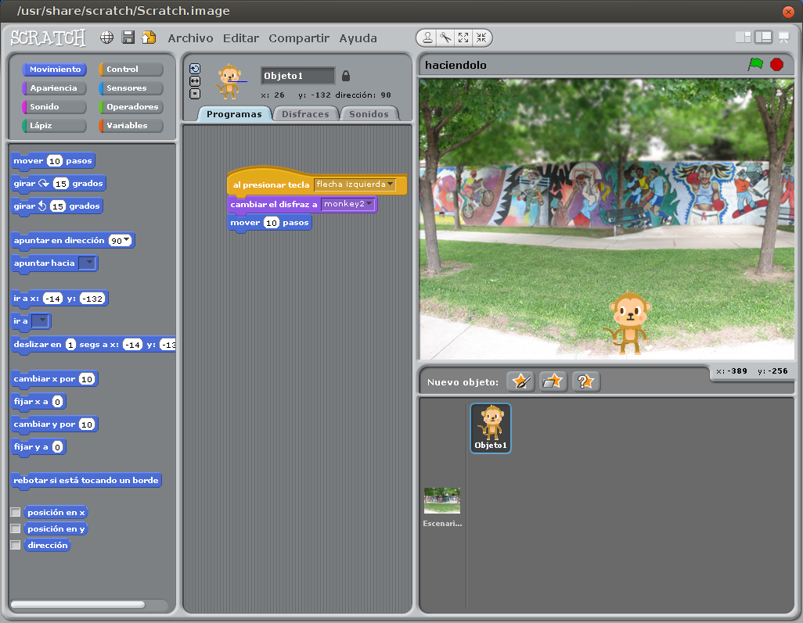

# Creación de Personajes

Vamos con nuestro personaje, protagonista de nuestro videojuego.

Lo primero es elegir un nuevo objeto:

Seleccionamos a nuestro personaje, que se encuentra en la carpeta animales:

Seleccionamos a "monkey1"

Como vemos la figura es muy grande, procederemos a dimensionarlo y situarlo en la parte inferior de la pantalla.

Para ello seleccionamos al personaje, con el botón derecho, seleccionamos del menú emergente, la opción ***redimensionar este objeto***.

Una vez redimensionado, lo ajustamos a nuestra línea base.

Es decir, quedaría así en la línea base

Una vez que hemos realizado estos pasos, procedemos a duplicar esta figura, pues vamos a retocar los ojos del personaje cuando mira a la izquierda y la derecha.

Tenemos que ir a disfraces y ahí es donde lo copiamos.

Una vez copiado el personaje, procedemos a modificar a donde apuntan los ojos (si damos dos veces en el personaje a modificar, nos aparece el editor de dibujo), borrando el color negro (pintamos con el cubo de pintura a blanco) y con el circulo dibujamos una elipse rellena de negro para pintar que ambos ojos miren a la izquierda.

Una vez terminado esto, podemos hacer que nuestro personaje cuando se mueva, los ojos miren hacia donde camina.
También podemos añadirle sonidos de movimiento a nuestro personaje, pulsamos los sonidos y escogemos el adecuado, incluso podemos grabar uno con nuestro micrófono y asignarlo al personaje.

Una terminado con esto, vamos a poner en marcha a nuestro personaje, vamos a darle movimiento de izquierda a derecha.
Nos vamos a la pestaña **Programas**, que nos aparecerá vacía de contenido y añadimos el tipo de movimiento que le vamos a a dar. Lo primero será hacer que vaya a la izquierda cuando pulse el cursor, y tenemos que decirle el número de pasos que se va a mover nuestro personaje.

En nuestro caso los pasos serán de 20 en 20 por cada pulsación de tecla. 

El personaje se moverá con la teclas del cursor.

Nos vamos al botón que pone **Control** (grupo de fichas de control).

Y seleccionamos la pieza de "al presionar tecla":

<!--
Presionar tecla

-->

Lo arrastramos...

Cambiamos a **flecha Izquierda**, para que cuando pulsemos el curso Izquierdo, se mueva.

Añadimos desde Apariencia, la pieza de **cambiar el disfraz a**

Y por último nos vamos a las piezas de Movimiento, cogemos la ficha Mover pasos.

Tenemos que cambiarlo a -20 pasos para que se mueva nuestro personaje.

Para el movimiento a la derecha el procedimiento es análogo, pero con dos cambios, usaremos la flecha derecha, el disfraz a usar será el monkey1 y el movimiento 20.

