# Creación de obstáculos

Seleccionamos nuevo objeto.

Y escogemos nuevo icono.

Seleccionamos la carpeta Things y seleccionamos el objeto bananas1

Una vez que lo tenemos en nuestra pantalla como se ve...

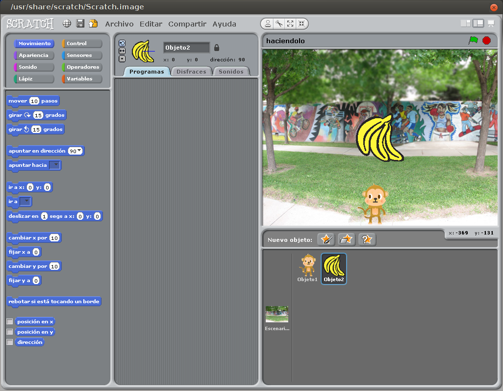

Procedemos a modificar su tamaño, lo escalamos a un tamaño proporcional a nuestro mono.

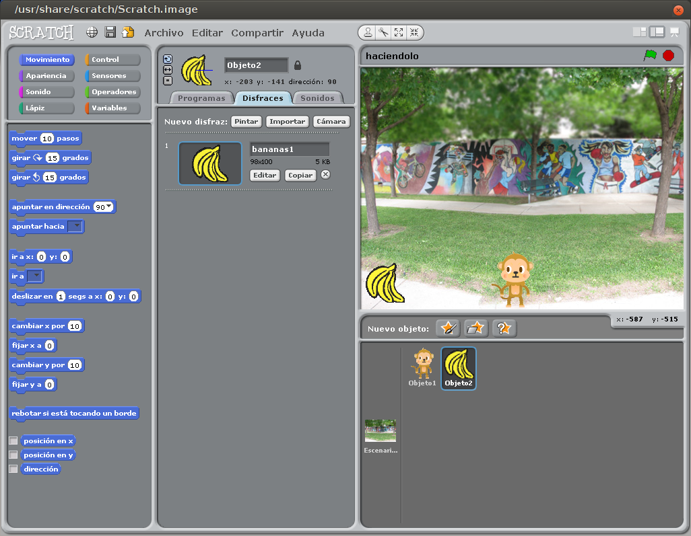

Vamos a darle movimiento a los plátanos.

Lo primero es la puesta en marcha, seleccionamos el siguiente elemento.

La arrastramos a la zona central, correspondiente a la pestaña Programas...
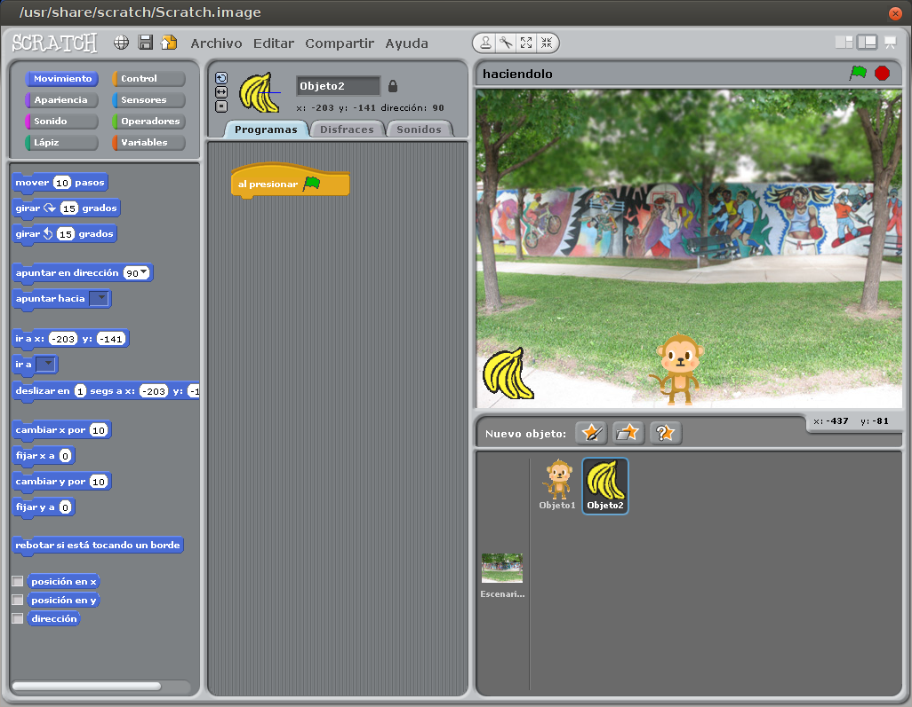

Le decimos en que dirección se tiene que mover, en nuestro caso es 180.

La arrastramos...
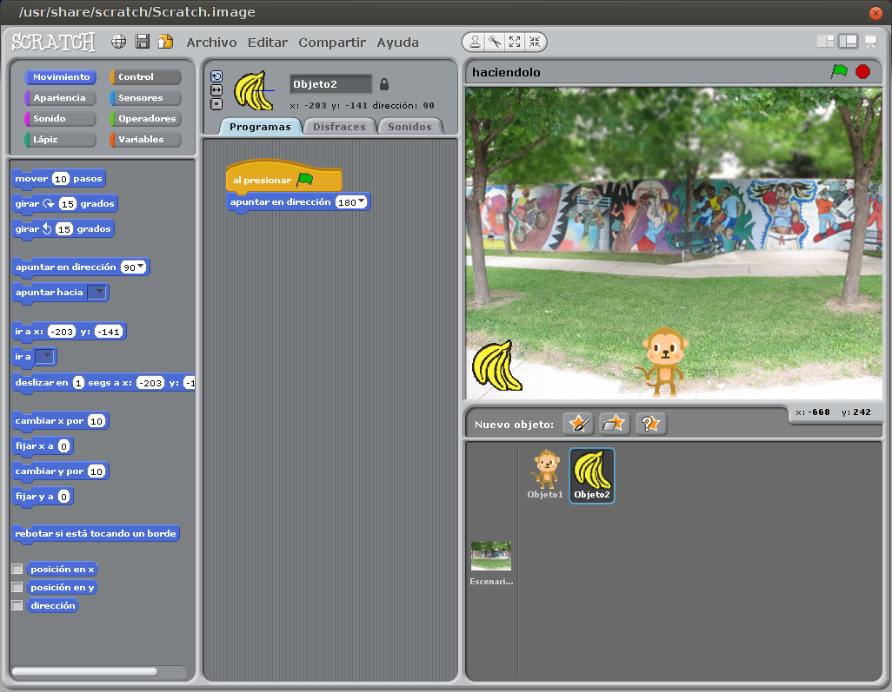

Ahora vamos a establecer el funcionamiento de los plátanos.

Usaremos la pieza de **por siempre** que es de tipo bucle.

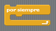

La arrastramos...

Cogemos la pieza **Si.. No** para establecer cuando se produce un roce, o un choque

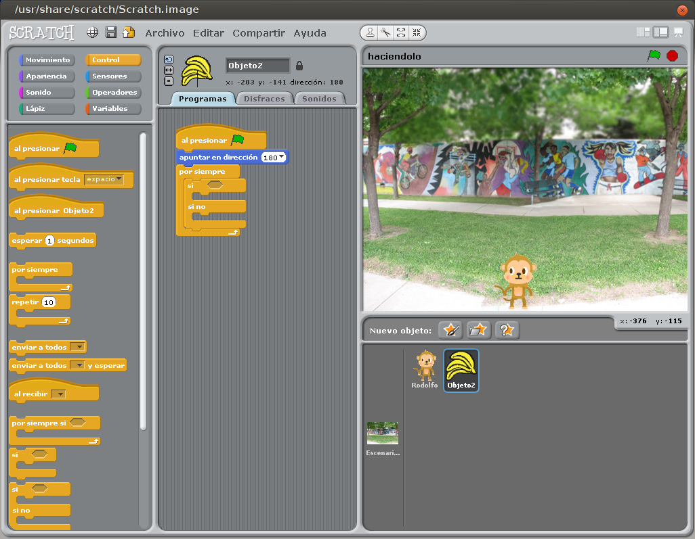

Añadimos si esta tocando a nuestro protagonista, Rodolfo.

Y lo penalizamos con 1 segundo de bloqueo (espera).

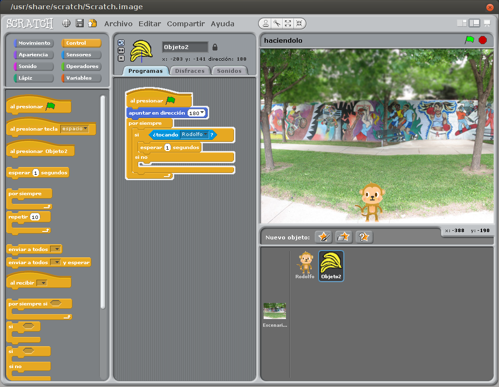

Al estar penalizado, lo escondemos...

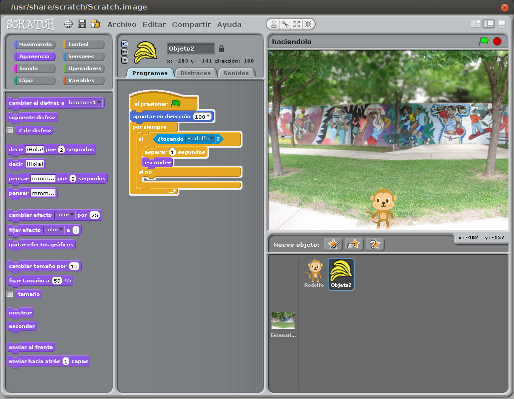

De nuevo lo ponemos en marcha...

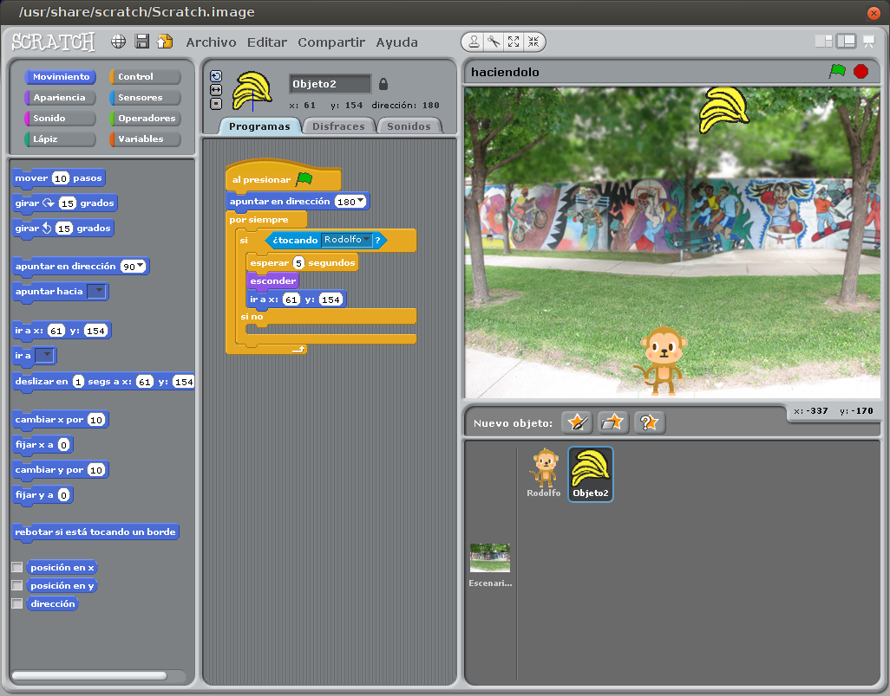

Y lo mostramos...

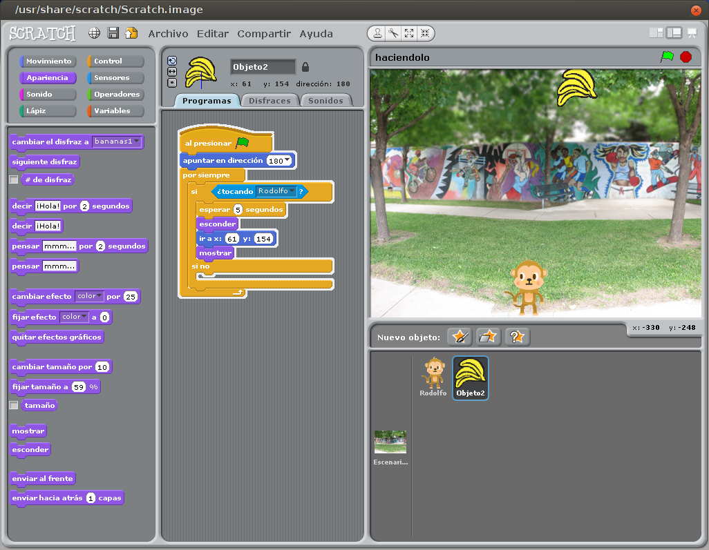

Ahora procederemos a controlar que no se salga de la pantalla.

Si toca el borde, escondemos el plátano...

Y lo cambiamos a la posición de inicio...

Y lo volvemos a mostrar...

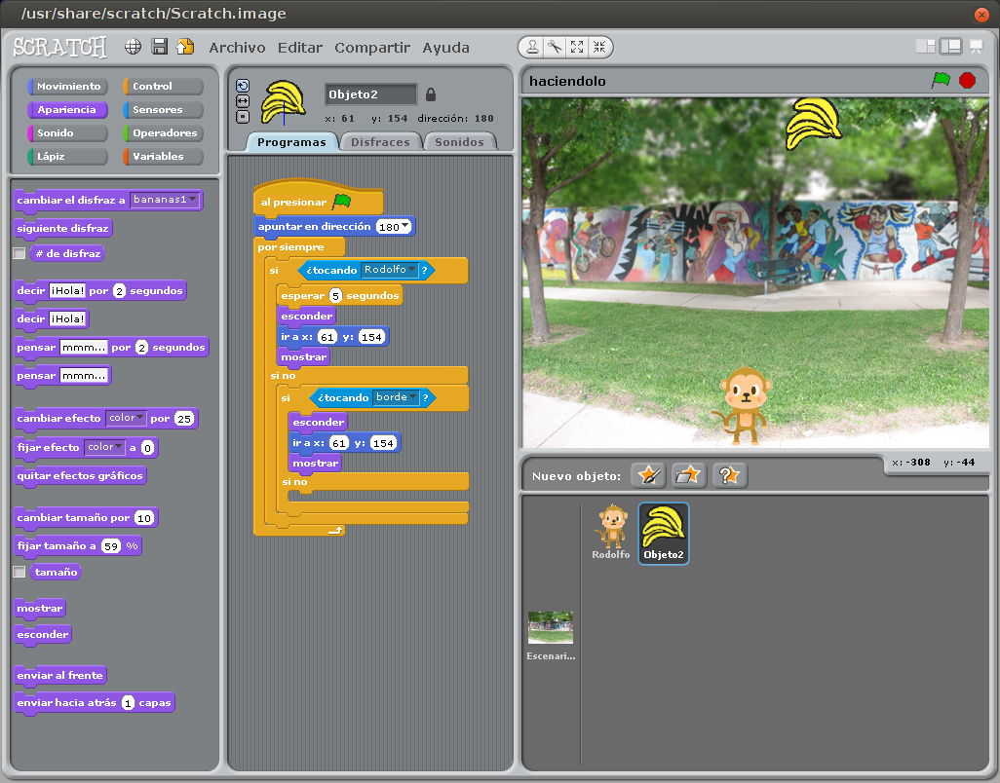

Para ponerlo en marcha le damos que se mueva 10 pasos...

Y ya tenemos nuestro plátano en marcha. solo nos queda triplicarlo para tener nuestro videojuego listo.

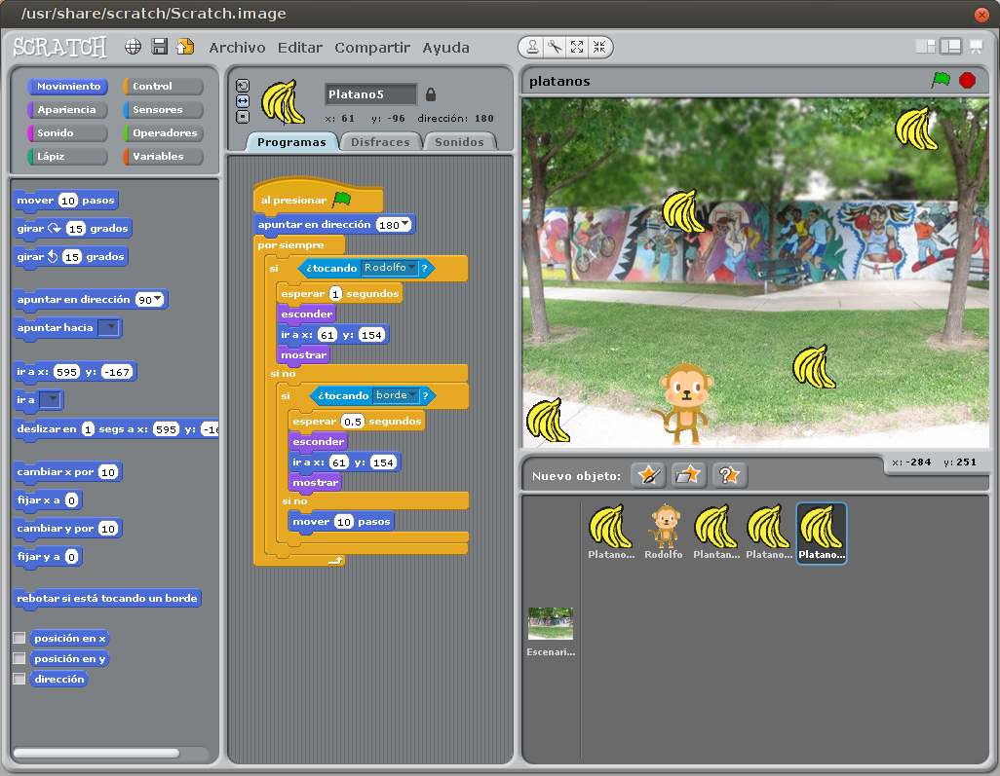
