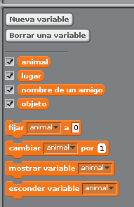
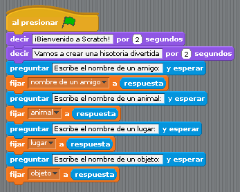
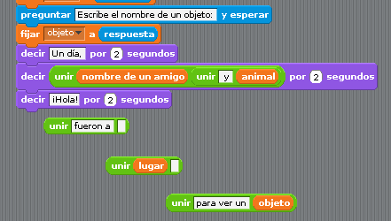

# Madlibs

Es este apartado aprenderemos a hacer y personalizar "Madlibs". Con Scratch podemos crear historias de diferentes formas. 

Este estilo te servirá de punto de partida para crear historias que ayuden a desarrollar habilidades a tus alumnos. Para construir este programa necesitaremos variables, piezas del grupo de apariencia y sensores. Para completar la historia haremos uso de piezas del grupo de operadores para unir resultados. El personaje tiene que realizar una serie de preguntas, a las que el alumno/usuario deberá contestar. Preparamos nuestro escenario con un fondo adecuado y añadimos los personajes que necesite nuestra historia.

La protagonista es una mariposa que sobrevuela unas flores.

 
Para nuestra historia (Madlibs) habilitaremos cuatro espacios para que los rellene el alumno. Estos cuatro espacios serán variables. Debemos crear tantas variables como espacios tenga nuestra historia. Este tipo de historias son plantillas que el alumno debe rellenar para crear una historia divertida. 

Vamos a crear las variables para este ejemplo.

Estas variables las esconderemos, para que no se vean en el escenario, haciendo click en la caja que aparece a la izquierda del nombre de la variable. También lo puedes hacer usando la pieza "esconder variable", siempre justo después de la ficha de control **"Al presionar bandera verde"**. La segunda parte de este ejemplo consiste en hacer las preguntas para rellenar los espacios de historia. 

Las respuestas se guardarán en las variables.

En la siguiente imagen se puede apreciar como a cada variable se le asigna una respuesta.

Una vez que ya tenemos las respuestas es el momento de construir la historia, con el operador **Unir**, concatenamos todas las respuestas e incluimos el texto para que al unir las respuestas la historia tenga sentido. 

A continuación el resultado final

Por último, unimos todos los pasos para construir el programa y comprobamos y evaluamos su funcionamiento. La creación de historias, comics, diálogos programa - alumno ... es otra de las grandes funcionalidades de Scratch dentro de la enseñanza. 

En cualquier unidad didáctica se puede incluir un programa de Scratch a modo de lección o ejemplo práctico.