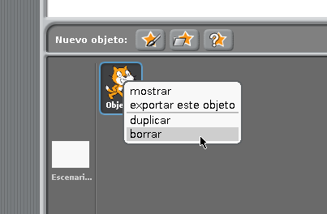
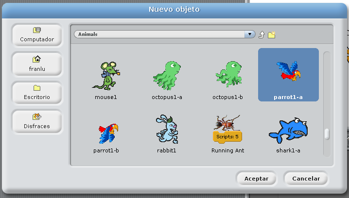
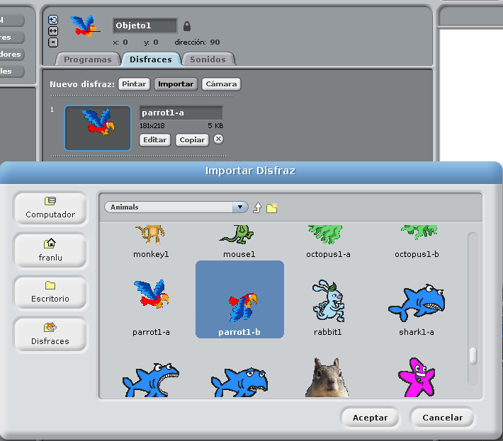
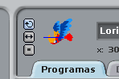

# Animaciones

Vamos a ver mediante un ejemplo como crear un dibujo animado con Scratch. 

En primer lugar necesitamos las imágenes correspondientes a nuestro personaje. En esta ocasión, nuestro personaje será un loro que volará a lo largo del escritorio.

Antes de localizar a nuestro loro, borraremos el gatito naranja de la lista de personajes. Situando el cursor sobre el personaje y pulsamos el botón derecho y aparece un menú. Elegimos la opción **borrar**.

A continuación añadiremos el nuevo personaje, que se encuentra en la carpeta "Animals" con el nombre "parrot1-a". Esto ya lo hemos visto con anterioridad como hacerlo.

Ahora seleccionamos a nuestro loro y le bautizamos, en la parte de arriba de la zona central de la ventana hacemos click sobre el texto "Objeto1", borramos el texto y le cambiamos el nombre a "Lorito", por ejemplo.

Después de cambiar el nombre clickamos sobre la pestaña "Disfraces" y pulsamos el botón "Importar", igual que en el paso anterior localizamos a nuestro loro, pero en esta ocasión seleccionamos "parrot1-b" y aceptamos.

Ya tenemos a nuestro personaje preparado para animarlo. Es un buen momento para añadir un fondo adecuado donde "Lorito" pueda volar.

Por defecto, el tamaño de Lorito es muy grande. Para establecer el tamaño de nuestro personaje lo podemos hacer de dos formas. Podemos utilizar el grupo de botones que se encuentra justo encima del escenario.

Vamos a hacer mas pequeño a "Lorito", seleccionando el botón mas a la derecha de los cuatro que aparecen y hacemos clic sobre el dibujo hasta que obtengamos el tamaño deseado. El botón que aparece a la izquierda de éste, hace la operación contraria.

Otra forma de hacer esta operación es mediante bloques/piezas del grupo "Apariencia". Es muy aconsejable usar estas piezas justo después de un bloque de control, por ejemplo, "Al presionar bandera verde". Estas piezas aparecen cuando tenemos seleccionado a nuestro personaje en la zona que hay debajo del escenario.

En la siguiente imagen aparece el código-puzzle de bloques para que "Lorito" vuele por el escenario. Cópialo y pruébalo... ¿vuela nuestro "Lorito"?

Hay que tener en cuenta un pequeño detalle. Cuando el personaje llega al borde del escenario rebota y realiza un giro. Existen dos maneras de hacer el giro. Comprueba los botones que aparecen a la izquierda del nombre de nuestro personaje, tal como aparece en las siguientes imágenes. Si queremos que el personaje no vuele boca abajo, pulsaremos el botón "solo mirar izquierda-derecha"

Como ejercicio práctico, selecciona otro personaje y escenario. Y haz que se mueva a distinta velocidad por el escenario. 