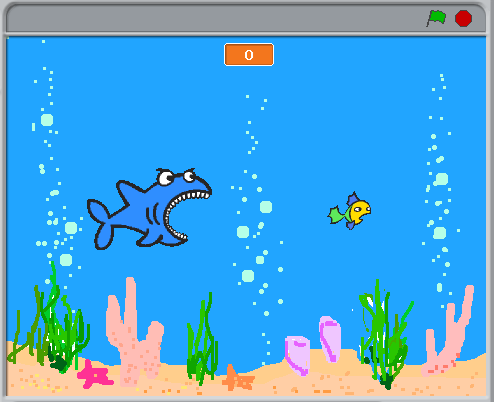
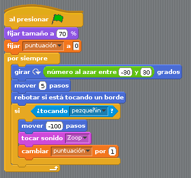

# Llevar la puntuación

En esta lección vamos a hacer uso de los conocimientos aprendidos en el Tema 2 sobre las variables.

El primer paso consiste en crear una variable llamada puntuación.

En este ejemplo trabajaremos dentro del mar. Elegimos un fondo para el escenario llamado "underwater", lo puedes encontrar en la carpeta "Nature". Habrá dos personajes, un tiburón azul (shark1-b) y un pez amarillo ("fish3"). Es necesario reducir el tamaño del pez amarillo y un poquito el tamaño del tiburón. Como siempre, personalizamos a los personajes con un nombre adecuado.

Regresamos con nuestra variable puntuación. Aparece en el escenario arriba a la izquierda, aunque se puede arrastrar a cualquier punto del escenario. También podemos cambiar su aspecto, haciendo clic con el botón derecho sobre la variable en el escenario, aparece un menú. En el caso de tener una sola variable, es aconsejable seleccionamos el apartado del menú llamado "grande". Veamos como queda nuestro programa después de estos cambios.

Es el momento de hacer que se muevan los personajes. Comenzaremos por el pez amarillo. En la siguiente imagen esta el puzzle que hemos formado con los bloques de Scratch para que el pez se mueva por todo el escenario.

En este puzzle hemos incluido un pieza de grupo de operadores dentro de una pieza de movimiento. Prestar atención al cuadro blanco, que nos indica la posibilidad de incluir una pieza dentro.

El puzzle que lleva el tiburón es similar al del pez amarillo. Las piezas nuevas que vamos a incluir son necesarias para comprobar cuanto el tiburón "se come" al pez y actualizar la puntuación (variable). Para unir dos bloques-puzzles, presta atención a la barra blanca que aparece, será el lugar donde se coloque la primera pieza del bloque que se esta arrastrando.

Con este puzzle el tiburón y el pez se moverán aleatoriamente por el escenario. Cuando el tiburón toque al pez, la puntuación se incrementará en una unidad, se escucha un sonido y el tiburón se moverá 100 pasos atrás.